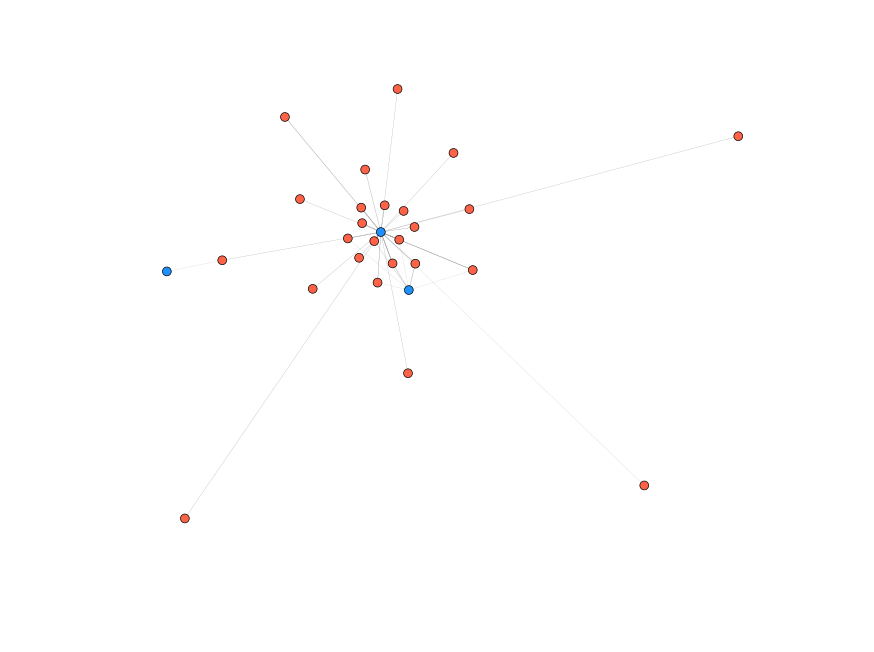

# gitnet

## Overview

`gitnet` is a Python 3 library with user friendly tools for collecting, cleaning, and exporting datasets from local Git repositories, as well as creating network models and visualizations. The primary purpose of `gitnet` is to provide scholarly tools to study the collaboration structure of free and open source software development projects, but may also be use to organizations, project managers, and curious coders.

`gitnet` is currently under active development by the University of Waterloo's **NetLab**. The current build offers flexible tools for working with local Git repositories. Future iterations will include support for collecting and modelling issue report and pull request data from front-end version control systems, tools for analyzing contributors' communication networks, reproducible data collection, and more tools for increased flexibility. If you are curious about our project, want tips regarding how to use `gitnet`, find a bug, or wish to request a feature, please feel free to email a contributor or submit an issue report.

## A Quick (Meta) Example

`gitnet` makes it easy to collect, clean, and model local Git repositories. Here, we used it to create a network model of contributions to `.py` files in our Git repository.

<br />

```{python}
import gitnet as gn

gn_log = gn.get_log("Users/localpath/gitnet")
gn_log.ignore("\.py$",ignoreif = "no match")

gn_net = gn_log.network("author/file")
gn_net.node_attributes("colour", helper = gn.author_file_node_colours)
gn_net.quickplot(layout = "spring", fname = "quick.pdf", size = 20)
```

<br />

This snippet imports `gitnet`, creates a `CommitLog` from our local repository, uses a regular expression to ignore files with names that end with `.py`, creates a `MultiGraphPlus` using presets for a bipartite author/file network, adds default file colourings to the graph's node attributes, and saves a basic visualization of the network. The result looks like this:


